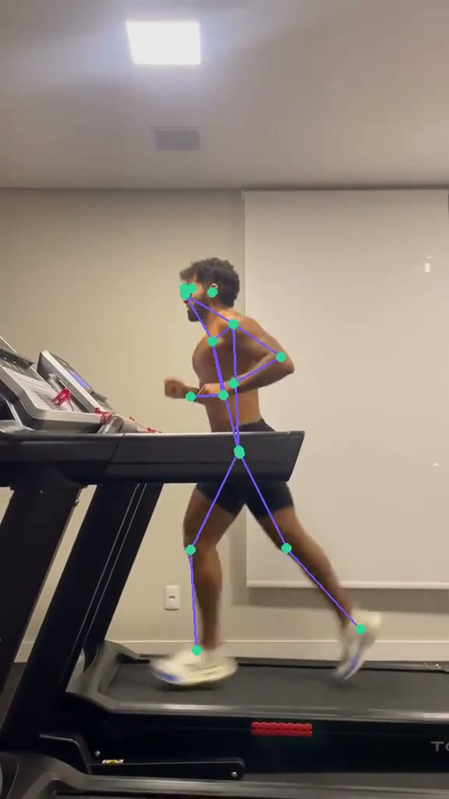

# StriderEdge OS

**IA de visão computacional para prevenção de lesão na corrida.**

O atleta filma a própria corrida com o celular. O StriderEdge enxerga o movimento, entende a
biomecânica da passada e devolve um **plano corretivo claro** — o que ajustar, por quê, e como
treinar isso — com **fontes científicas citadas**. Tudo pensado para rodar de forma privada, sem
depender de nuvem de terceiros. Só uma câmera.

  
   
  A IA lê a passada quadro a quadro — juntas e ângulos que viram o diagnóstico de forma.

## Por que existe

A maioria das lesões de corrida é de sobrecarga e se anuncia na forma muito antes de doer. Mas
análise de corrida boa hoje mora em laboratório: cara, rara e inacessível pra quem corre no fim de
semana. O StriderEdge nasce pra levar essa leitura pro bolso do atleta — com uma régua importante:
**é um app de risco de lesão, então o conselho precisa ser correto, honesto e aterrado na
ciência.** Quando a captura não é boa o bastante, ele diz "não dá pra afirmar" em vez de chutar.

## O que ele faz

- **Vê a passada.** A partir de um vídeo comum, extrai indicadores de forma relevantes pra corrida.
- **Traduz em causa-raiz.** Cruza o que foi medido com faixas da literatura e aponta os desvios que
  mais importam — em ordem de risco.
- **Prescreve, não só descreve.** Entrega um plano corretivo com exercícios e um jeito prático de
  você medir e acompanhar o próprio progresso.
- **Cita a fonte.** Cada recomendação vem amarrada a evidência científica real — nada de palpite.
- **Fala a sua língua.** Explica o "porquê" como um bom treinador faria, não como um artigo.
- **É honesto sobre o que não sabe.** Sinaliza medições incertas e pede uma refilmagem quando o
  vídeo não permite uma leitura confiável.

## Estado

Projeto em desenvolvimento ativo. O núcleo — do vídeo ao plano corretivo citado — funciona de ponta
a ponta. Partes da validação científica e do empacotamento seguem evoluindo.

> Este repositório contém o **código-fonte** do projeto. Modelos, pesos e dados de vídeo **não**
> são versionados aqui.

## Licença

Código sob licença **MIT** — veja [`LICENSE`](LICENSE).

Componentes de terceiros (modelos de pose, runtime de inferência, LLM local e bases científicas)
permanecem sob suas próprias licenças e termos, respeitados separadamente.

---

StriderEdge OS é uma ferramenta de educação e prevenção, não um dispositivo médico nem
substituto de avaliação profissional de saúde.
